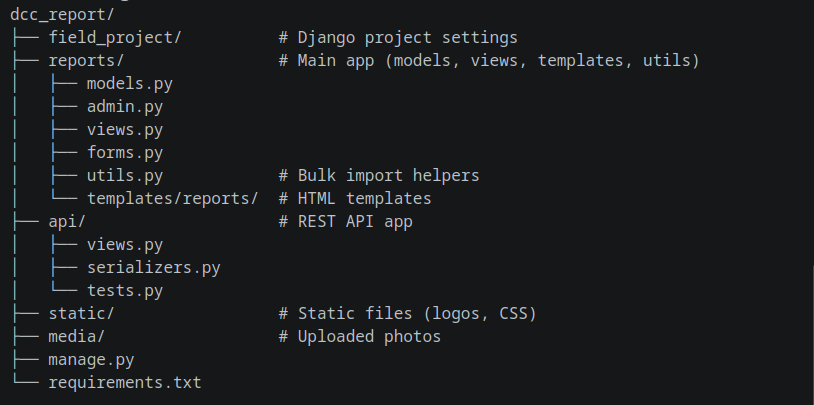

# 📋 Field Report Generator

A Django‑based web application for collecting field installation data of network devices (ONU, Indoor APs, Outdoor AP) at institutions. It generates a **per‑institution PDF report** and a **per‑DCC Excel summary** with installation photos. A RESTful API enables integration with external systems.

---

## ✨ Features

- **Interactive web form** – mimics official paper‑based installation forms with dynamic QTY and N/A placeholders.
- **PDF generation** – each institution gets a polished, A4‑sized PDF report (supports preview and download).
- **Excel reports** – two‑sheet workbook per DCC:
  - Sheet 1: Device summary table mirroring official serial‑number logs.
  - Sheet 2: Before/After installation photos with device‑type labels.
- **Bulk import** – upload an Excel file and a ZIP of photos to automatically create multiple institution records.
- **Admin‑friendly** – Django Admin integration with clickable preview/download links and bulk actions.
- **REST API** – full CRUD + file uploads for integration with mobile apps or third‑party tools.
- **Swagger documentation** – interactive API docs at `/api/swagger/`.

---

## 🛠️ Tech Stack

- Python 3.8+
- Django 4.2+
- WeasyPrint (PDF generation)
- openpyxl (Excel generation)
- Pillow (image handling)
- Django REST Framework (API)
- drf‑yasg (Swagger docs)

---

## ⚙️ Prerequisites

- Python 3.8+ and pip
- Virtual environment tools (virtualenv, venv, or pipenv)
- System libraries for WeasyPrint:
  - **Ubuntu/Debian**: `sudo apt-get install build-essential python3-dev libcairo2 libpango-1.0-0 libpangocairo-1.0-0 libgdk-pixbuf2.0-0 libffi-dev shared-mime-info`
  - **macOS**: `brew install cairo pango gdk-pixbuf libffi`
  - **Windows**: install GTK3 runtime from [GTK for Windows](https://github.com/tschoonj/GTK-for-Windows-Runtime-Environment-Installer)

---

## 📥 Installation & Setup

1. **Clone the repository**
   ```bash
   git clone https://github.com/jumagemini/dcc-report.git
   
   cd field-report-generator
   ```
2. **Create and activate a virtual environment**
   '''bash
   python -m venv venv
   source venv/bin/activate   # Linux/macOS
   venv\Scripts\activate      # Window
   
3. **Install dependencies**
   ```bash
   pip install -r requirements.txt
   ```
   
   If no *requirements.txt* exists, install manually:
   ```bash
   pip install django openpyxl WeasyPrint Pillow djangorestframework drf-yasg
   ```
4. Configure environment variables (optional)
   
   Create a *.env* file or export variables for sensitive settings. In *settings.py*, replace hard‑coded values with *os.environ.get()*.
5. Run database migrations
   ```bash
   python manage.py migrate
   ```
6. Create a superuser (for admin access)
   ```bash
   python manage.py createsuperuser
   ```
7. Collect static files (if needed)
   ```bash
   python manage.py collectstatic
   ```         
8. Start the development server
   ```bash
   python manage.py runserver
   ```
9. Access the application
   * Web form: **http://127.0.0.1:8000/dcc/1/add/** (create a DCC via admin first)

   * Admin panel: **http://127.0.0.1:8000/admin/**

   * API demo: **http://127.0.0.1:8000/api/demo/**

   * Swagger UI: **http://127.0.0.1:8000/api/swagger/**
   
   
## 🚀 Quick Start
1. Log in to the Django Admin and create a DCC entry (e.g., *TINDERET DCC*).

2. Navigate to */dcc/1/add/* to fill the installation form for an institution.

3. Upload before/after photos for each device.

4. Click *Save Installation & Generate PDF* – a PDF preview opens in a new tab.

5. Go to Admin → Institutions to view/download individual PDFs.

6. To get the Excel report: */dcc/1/excel/* or click the link in the DCC admin list.
## 📂 Project Structure


## 📝 API Documentation
The API provides endpoints for managing DCCs, institutions, and photos. When the server is running, visit:

Swagger UI: **http://127.0.0.1:8000/api/swagger/**

ReDoc: **http://127.0.0.1:8000/api/redoc/**

## Authentication
To use authenticated endpoints, obtain a token:

```bash
curl -X POST http://127.0.0.1:8000/api/auth/ -H "Content-Type: application/json" -d '{"username":"admin","password":"yourpassword"}'
```
Then include the token in requests:

```bash
curl -H "Authorization: Token 9944b091..." http://127.0.0.1:8000/api/dccs/
```
## 🧪 Running Tests
```bash
python manage.py test api -v 2
```
Or use pytest for a more interactive output:

```bash
pip install pytest pytest-django pytest-sugar

pytest api/tests.py
```
## 🤝 Contributing
Contributions are welcome! Please [open an issue](https://github.com/jumagemini/dcc-report/issues "Project Issue") or submit a pull request.
## 💡 Need Help?
If you encounter any issues, please [open an issue](https://github.com/jumagemini/dcc-report/issues "Project Issue") with a clear description and steps to reproduce.

 
